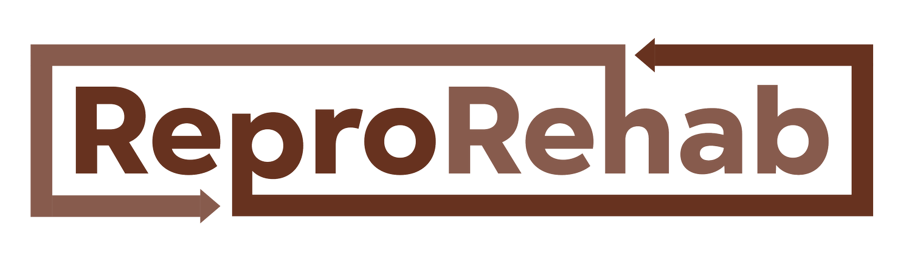

## Pod 1 

This page serves to organize links and resources that will be used throughout the year.

## Teaching Assistants: 

Alexandra Reed, BS

[Madeline Ratoza, PT, DPT, PhD](https://www.madelineratoza.com/)

## Resources and Links

[Syllabus](https://docs.google.com/document/d/19pez6JVym8xbMrJAHm7beY213i19g4MF/edit?usp=sharing&ouid=116572267343073467545&rtpof=true&sd=true)

Slack Channel

[ReproRehab Github](https://github.com/reprorehab/reprorehab2026-pod1)

[Google Drive](https://drive.google.com/drive/folders/1LEQUHGL-NXa6rSw6Od74OalAv0U6V_bR)
